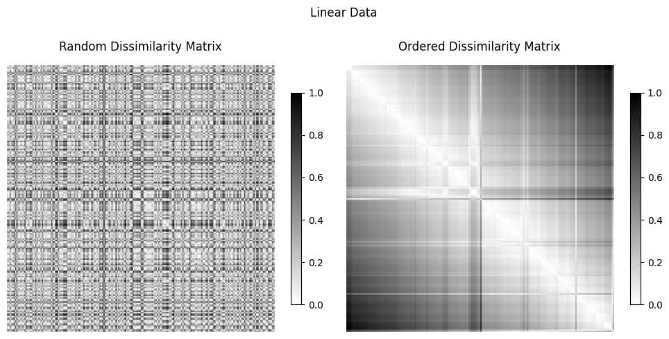
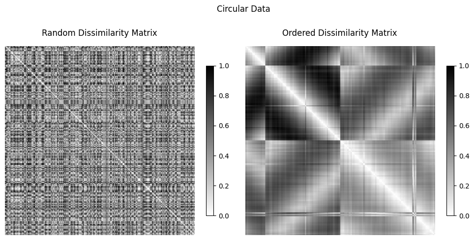
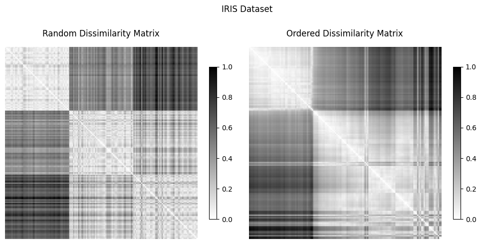

# vat-cluster-tendency-assessment

Visual Assessment of Tendency (VAT): a tool for assessing cluster tendency.

## Project Overview
This project implements the Visual Assessment of Tendency (VAT) algorithm, which helps in visually assessing the clustering tendency of a dataset. Unlike traditional clustering methods that automatically assign clusters, VAT allows users to check whether meaningful clusters exist before applying clustering algorithms.

## Team Members
- Prasanna Kumar Adabala
- Brahma Reddy Maddireddy
- Raghuram Munagala
- Mouna Priya Pokuru
- Bhargavi Akula

## Features
- Computes the dissimilarity matrix for input data
- Applies VAT ordering to the matrix
- Visualizes the ordered and unordered dissimilarity matrices
- Supports object and relational data
- Works with multiple distance metrics

## Prerequisites
Before installing and running the project, ensure you have the following installed:
- Python 3.7 or later
- pip (Python package manager)
- Virtual environment (optional but recommended)
- Git (for cloning the repository)
- Jupyter Notebook (for running the notebook version)

## Installation
To set up and run the project, follow these steps:

```bash
# Clone the repository
git clone https://github.com/Raghuram-9666/Vat-Cluster-Tendency-Assessment.git
cd vat-cluster-tendency-assessment

# Create a virtual environment (optional but recommended)
python3 -m venv venv
source venv/bin/activate  # On Windows use 'venv\Scripts\activate'

# Install dependencies
pip install -r requirements.txt
```

## Usage

### Running the Jupyter Notebook
If you prefer to use the Jupyter Notebook version, run:

```bash
vat-cluster-tendency-assessment.ipynb
```

This notebook contains the VAT algorithm implementation along with various test cases.

## Algorithm Implementation
The VAT algorithm follows these steps:
1. Compute the dissimilarity matrix using a chosen metric (e.g., Euclidean distance).
2. Reorder the matrix based on minimum dissimilarities.
3. Visualize the reordered matrix as an intensity image.

## Test Cases
We evaluated the VAT algorithm on different datasets:
1. **Linear Data**: No significant clusters observed.
2. **Circular Data**: Two clear clusters identified.
3. **Iris Dataset**: Three clusters detected, matching known classifications.
4. **Diabetes Prediction Dataset**: Some clustering structure observed.
5. **Large Random Dataset**: Assesses VAT's scalability.

## Results
The VAT algorithm successfully identified clustering tendencies in datasets, confirming its effectiveness in exploratory data analysis.

**Linear — no hidden structure, VAT shows no clusters:**


**Circular — two clear clusters appear after ordering:**


**Iris — three clusters, matching the known species:**


## Limitations
- Computationally expensive for very large datasets.
- Requires interpretation of visualization.
- Does not provide explicit cluster labels.

## Future Work
- Optimize for large datasets using subsampling techniques.
- Explore enhancements using deep learning-based similarity measures.

## References
- J.C. Bezdek & R.J. Hathaway, "VAT: A Tool for Visual Assessment of (Cluster) Tendency"
- Python Libraries: NumPy, Pandas, SciPy, Scikit-learn, Matplotlib


